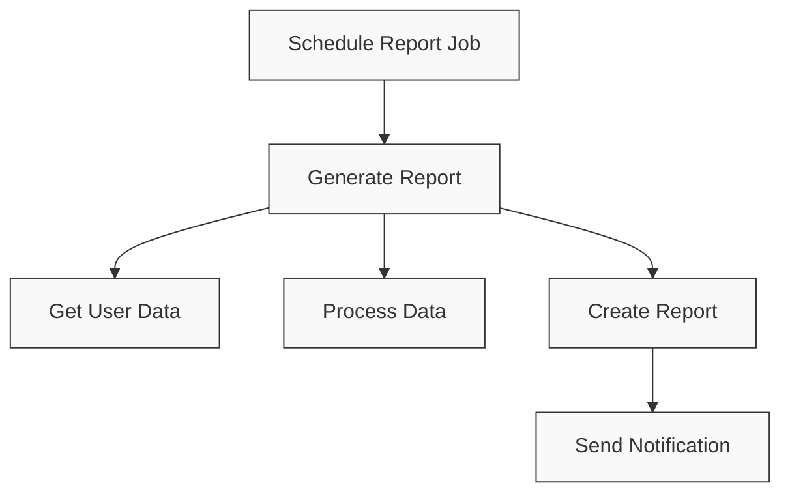
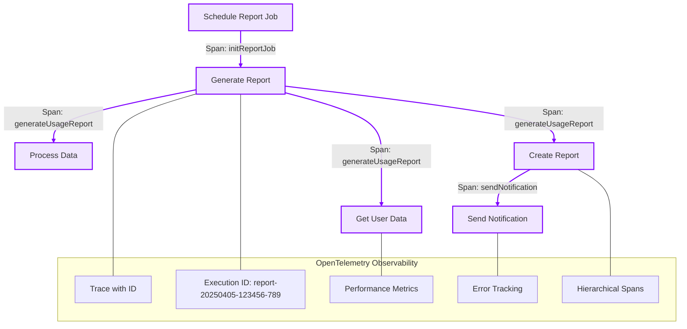

# OpenTelemetry NodeJS Demo

> A practical demonstration of OpenTelemetry implementation in a NodeJS application

This project demonstrates how to implement OpenTelemetry tracing in a real-world NodeJS application with multiple services and scheduled jobs.

## Quick Start

```bash
# Start Jaeger for telemetry visualization
docker-compose up -d

# Install dependencies
npm install

# Run with telemetry enabled (default)
npm start

# View traces in Jaeger UI
# Open http://localhost:16686 in your browser
```

## Project Overview

This demo includes:

- **5 Core Services**: User, Data, Notification, Authentication, and Logging
- **2 Scheduled Jobs**: Data Backup and Report Generation
- **OpenTelemetry Integration**: Complete tracing with nested spans, context propagation, and error handling

## Key Features Demonstrated

- ✅ **Hierarchical Tracing**: Nested spans showing parent-child relationships in complex operations
- ✅ **Execution ID Tracking**: Time-based execution IDs for correlating related operations
- ✅ **Span Attributes**: Contextual information attached to spans for better observability
- ✅ **Error Handling**: Proper error recording and propagation in spans
- ✅ **Toggle Telemetry**: Enable/disable telemetry through environment variables

## Adding Telemetry to Your Code: Step-by-Step Guide

### 1. Basic Pattern: The Private Implementation Approach

```javascript
// BEFORE: Original function
function processOrder(order) {
  // Implementation
}

// AFTER: With telemetry
// Step 1: Create private implementation
function _processOrder(order) {
  // Same implementation as before
}

// Step 2: Create public wrapper with telemetry
function processOrder(order) {
  const executionId = generateExecutionId('order');
  
  return telemetry.wrapWithSpan(
    'processOrder', 
    { 'order.id': order.id, 'execution.id': executionId }, 
    () => _processOrder(order)
  );
}
```

### 2. Creating Hierarchical Traces

```javascript
// Parent function
function _processOrder(order) {
  // Validate order first
  _validateOrder(order);
  
  // Process payment
  const payment = _processPayment(order.payment);
  
  // Create shipment
  const shipment = _createShipment(order.items, order.address);
  
  return { orderId: order.id, status: 'completed' };
}

// Child function with its own span
function _validateOrder(order) {
  return telemetry.wrapWithSpan(
    '_validateOrder',
    { 'order.id': order.id },
    () => {
      // Validation logic
      return isValid;
    }
  );
}
```

### 3. Error Handling in Spans

```javascript
function processOrder(order) {
  return telemetry.wrapWithSpan(
    'processOrder', 
    { attributes }, 
    async (span) => {
      try {
        const result = await _processOrder(order);
        return result;
      } catch (error) {
        // Record error in span
        span.setStatus({
          code: SpanStatusCode.ERROR,
          message: error.message
        });
        span.recordException(error);
        throw error;
      }
    }
  );
}
```

## Real-World Examples

### Data Backup Job Example

This example demonstrates a complete implementation of telemetry in a scheduled backup job:

```javascript
// PUBLIC API
const initBackupJob = telemetry.wrapWithSpan(_initBackupJob, 'initBackupJob', {
  'job.name': 'dataBackupJob',
  'job.type': 'cron',
});

function performBackup(executionId) {
  const execId = executionId || generateExecutionId('backup');
  return telemetry.wrapWithSpan(() => _performBackup(execId), `performBackup.${execId}`, {
    'backup.type': 'scheduled',
    'backup.execution_id': execId,
  })();
}

// IMPLEMENTATION DETAILS
function _initBackupJob() {
  if (!CONFIG.enabled) {
    loggingService.logInfo('Data backup job is disabled');
    return false;
  }

  loggingService.logInfo(`Scheduling data backup job with schedule: ${CONFIG.schedule}`);

  const job = cron.schedule(CONFIG.schedule, () => {
    const executionId = generateExecutionId('backup');
    const executionTracer = telemetry.getTracer(`dataBackupJob.${executionId}`);

    executionTracer.startActiveSpan('backupJob.execution', span => {
      try {
        span.setAttribute('backup.scheduled_time', new Date().toISOString());
        span.setAttribute('backup.cron_pattern', CONFIG.schedule);
        span.setAttribute('backup.execution_id', executionId);

        const result = performBackup(executionId);

        span.setAttribute('backup.success', result.success);
        span.end();
        return result;
      } catch (error) {
        span.recordException(error);
        span.setStatus({ code: SpanStatusCode.ERROR });
        span.end();
        throw error;
      }
    });
  });

  return job;
}
```

### Notification Chain Example

This shows a more complex service with multiple nested levels:

```javascript
// PUBLIC API
const sendNotification = telemetry.wrapWithSpan(
  _sendNotification,
  'notificationService.sendNotification',
  { 'notification.operation': 'send' }
);

// IMPLEMENTATION DETAILS
function _sendNotification(userId, message, channel = 'email') {
  try {
    const notificationId = uuidv4();
    const content = await _prepareNotificationContent(userId, message, channel);
    
    // Record notification
    notifications[notificationId] = { /*...*/ };
    
    // Deliver through chosen channel
    const deliveryResult = await _deliverNotification(userId, notifications[notificationId], channel);
    
    notifications[notificationId].status = 'sent';
    return notifications[notificationId];
  } catch (error) {
    loggingService.logError(`Failed to send notification: ${error.message}`);
    throw error;
  }
}

// Nested functions with their own spans
function _prepareNotificationContent(userId, message, channel) {/*...*/}
function _getUserNotificationPreferences(userId) {/*...*/}
function _getUserDeviceInfo(userId) {/*...*/}
function _deliverNotification(userId, notification, channel) {/*...*/}
```

## Visualizing Telemetry Implementation with Diagrams

### Report Generation Job - Before vs After Telemetry

The following diagrams illustrate how report generation works before and after implementing OpenTelemetry:

#### Before Adding Telemetry



**Issues with this approach:**
- No traceability between operations
- Difficult to measure performance of individual steps
- Limited visibility into errors
- No correlation between related operations

#### After Adding Telemetry



**Benefits from telemetry:**
- Each operation has its own span for detailed tracking
- Unique execution ID connects all related operations
- Performance metrics captured for each step
- Error information recorded with complete context
- Visual representation in Jaeger UI showing hierarchical relationships

### Execution Flow Difference

#### Traditional Approach
- Function calls occur linearly
- Errors might be logged but context is limited
- No performance metrics for individual operations
- Difficult to trace request path through complex operations

#### Telemetry-Enhanced Approach
- Each operation creates spans that capture:
  - Timing information (start/end)
  - Operation context (parameters, IDs)
  - Relationship to parent operations
  - Error details with stack traces
  - Custom attributes for business context

## Configuring OpenTelemetry

### Installation

```bash
npm install @opentelemetry/api @opentelemetry/sdk-node @opentelemetry/auto-instrumentations-node @opentelemetry/exporter-trace-otlp-http
```

### Using telemetry.js as Your Standard Implementation

The `src/middleware/telemetry.js` file in this project provides a standard, production-ready implementation that you should use as your template. This implementation:

1. Handles initialization and configuration 
2. Provides convenient wrapper methods for tracing
3. Supports enabling/disabling telemetry at runtime
4. Includes proper error handling and context propagation

#### Key Parts of telemetry.js

```javascript
// Create a singleton Telemetry class
class Telemetry {
  constructor(serviceName, serviceVersion, enabled = true) {
    this.serviceName = serviceName || process.env.SERVICE_NAME || 'default-service';
    this.serviceVersion = serviceVersion || process.env.SERVICE_VERSION || '1.0.0';
    this.enabled = enabled;
    this.initialized = false;
  }
  
  // Enable/disable telemetry at runtime
  setEnabled(enabled) {
    this.enabled = !!enabled;
    return this;
  }
  
  // Core tracing method - wrap any function with tracing
  wrapWithSpan(fn, name, attributes = {}) {
    // If telemetry is disabled, just return the original function
    if (!this.enabled) {
      return (...args) => fn(...args);
    }
    
    return (...args) => {
      const tracer = this.getTracer(name.split('.')[0] || 'default');
      return tracer.startActiveSpan(name, { attributes }, span => {
        try {
          const result = fn(...args);
          
          // Handle promises
          if (result && typeof result.then === 'function') {
            return result
              .then(value => {
                span.end();
                return value;
              })
              .catch(error => {
                span.setStatus({ code: SpanStatusCode.ERROR });
                span.recordException(error);
                span.end();
                throw error;
              });
          }
          
          span.end();
          return result;
        } catch (error) {
          span.setStatus({ code: SpanStatusCode.ERROR });
          span.recordException(error);
          span.end();
          throw error;
        }
      });
    };
  }
  
  // Additional methods...
}

// Create singleton instance
const telemetry = new Telemetry(
  process.env.SERVICE_NAME,
  process.env.SERVICE_VERSION,
  process.env.TELEMETRY_ENABLED !== 'false'
);

// Export the singleton
module.exports = telemetry;
```

#### Why Use This as a Standard

1. **Consistent API**: Provides a unified API across your codebase
2. **Environment-aware**: Automatically configures from environment variables
3. **Toggle Support**: Can easily disable telemetry without code changes
4. **Error Handling**: Properly records errors and ends spans
5. **Promise Support**: Handles both synchronous and asynchronous code
6. **Lightweight**: Minimal overhead when disabled
7. **Maintainable**: Centralized configuration makes updates easier

To use this in your project, copy the `telemetry.js` file to your project and start using the exported `telemetry` object throughout your codebase.

### Enable/Disable Telemetry

#### Using Environment Variables

Create a `.env` file:

```
# Enable/disable telemetry
TELEMETRY_ENABLED=true

# Service configuration
SERVICE_NAME=my-service-name
SERVICE_VERSION=1.0.0

# Exporter configuration
OTEL_EXPORTER_OTLP_ENDPOINT=http://localhost:4318/v1/traces
```

#### Using Runtime API

```javascript
// Disable telemetry at runtime
telemetry.setEnabled(false);

// Check if telemetry is enabled
console.log(`Telemetry enabled: ${telemetry.isEnabled()}`);
```

#### Running with Different Configurations

```bash
# Run with telemetry enabled (default)
npm start

# Run with telemetry explicitly enabled
npm run start:with-telemetry

# Run with telemetry disabled
npm run start:no-telemetry

# Check current configuration
npm run test:config
```

## Viewing Traces in Jaeger

After running the application, open Jaeger UI:

1. Go to http://localhost:16686
2. Select a service from the dropdown (e.g., "service-cronjob-demo")
3. Click "Find Traces"
4. Select a trace to see detailed span information

### Interpreting Traces

- **Trace View**: Shows the complete execution flow with nested spans
- **Timeline**: Visual representation of execution duration
- **Tags/Attributes**: Contains additional context (look for execution_id, etc.)
- **Logs**: Shows events recorded during execution

### Finding Specific Information

- Use the search feature to find traces with specific attributes
- Example: Search for `backup.execution_id=backup-20250403-*` to find all backups from a specific day
- Click on a span to view detailed attributes (additional context that might not be visible in the main view)

## Running Tests

```bash
# Test notification chain (5 nested levels)
npm run test:notification-chain

# Test report job initialization
npm run test:report-job
```

## Project Structure

```
├── src/
│   ├── services/           # Service modules
│   ├── jobs/               # Scheduled job modules
│   ├── middleware/
│   │   └── telemetry.js    # OpenTelemetry configuration
│   └── utils/
│       └── idGenerator.js  # Time-based execution ID generator
└── tests/                  # Test examples showing telemetry in action
```

---

For more details, refer to the official [OpenTelemetry documentation](https://opentelemetry.io/docs/).
